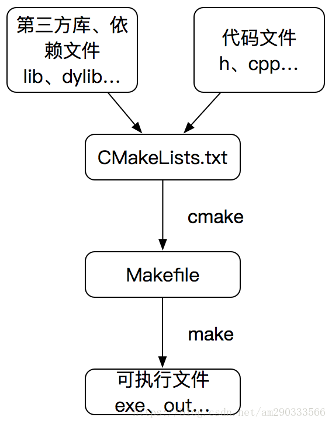
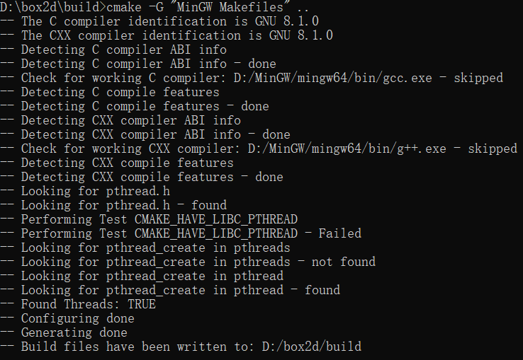
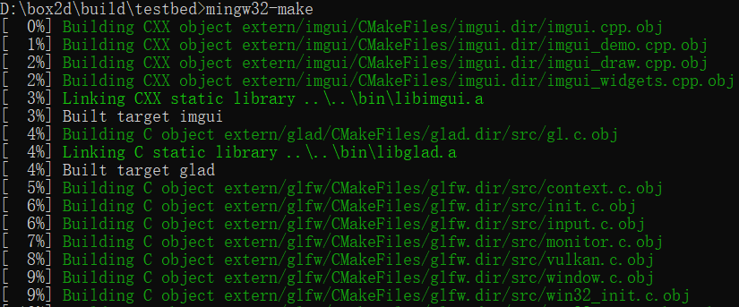

## Cmake与MingW-make的区别
<!-- $$
\lim(x\to\infin)\frac{\sin(t)}{x}=1
$$

| xiaoming | fafa | daxming |
| -------- | ---- | ------- |
| 12,      | afa  | faf     |

```
javafh(int i)
faf
``` -->
Cmake支持跨平台，需要规则文件，即**CMakelists.txt**，根据该规则文件生成Makefile。  
MingW-make同样跨平台，但该程序是作用对象是Makefile文件。

大概流程如下图：  
<div align=center></div>  


那如何将Cmake和MingW-make结合起来使用呢？  
&emsp;&emsp;首先我们提前准备好Cmake[(如何安装配置)](https://cmake.org/download/)、一个c/cpp文件、一个CMakelists.txt文件。  
### hello.cpp
```
#include <iostream>
using namespace std;
 
int main(){
	cout << "hello word cmake!!!" <<  endl;
    
	return 0;
}
```

### CMakelists.txt
```
<pre name="code" class="cpp"><pre name="code" class="cpp">
#设置C编译器
set(CMAKE_C_COMPILER "gcc")
set(CMAKE_C_FLAGS "-g -Wall  -I C:\\mingw-4.81\\mingw\\include -L C:\\mingw-4.81\\mingw\\lib")
 
#设置C++编译器
set(CMAKE_CXX_COMPILER "g++")
set(CMAKE_CXX_FLAGS "-g -Wall  -I C:\\mingw-4.81\\mingw\\include -L C:\\mingw-4.81\\mingw\\lib")
 
PROJECT (HELLO CXX)
SET(SRC_LIST hello.cpp)
ADD_EXECUTABLE(hello ${SRC_LIST})
 
MESSAGE(STATUS "This is BINARY dir " ${HELLO_BINARY_DIR})
MESSAGE(STATUS "This is SOURCE dir " ${HELLO_SOURCE_DIR})
```
**CMAKE_C_COMPILER**：指定C编译器  
**CMAKE_CXX_COMPILER**：指定C++编译器  
**CMAKE_C_FLAGS**：指定编译C文件时编译选项，也可以通过add_definitions命令添加编译选项  
**PROJECT**：

**效果图：**
<center>
    
    <div style="font-size:12px;color:#4F42F;">
    Box2D引擎源码(a)
</center>

<center>
    
    <div style="font-size:12px;color:#4F42F;">
    Box2D引擎源码(b)
</center>