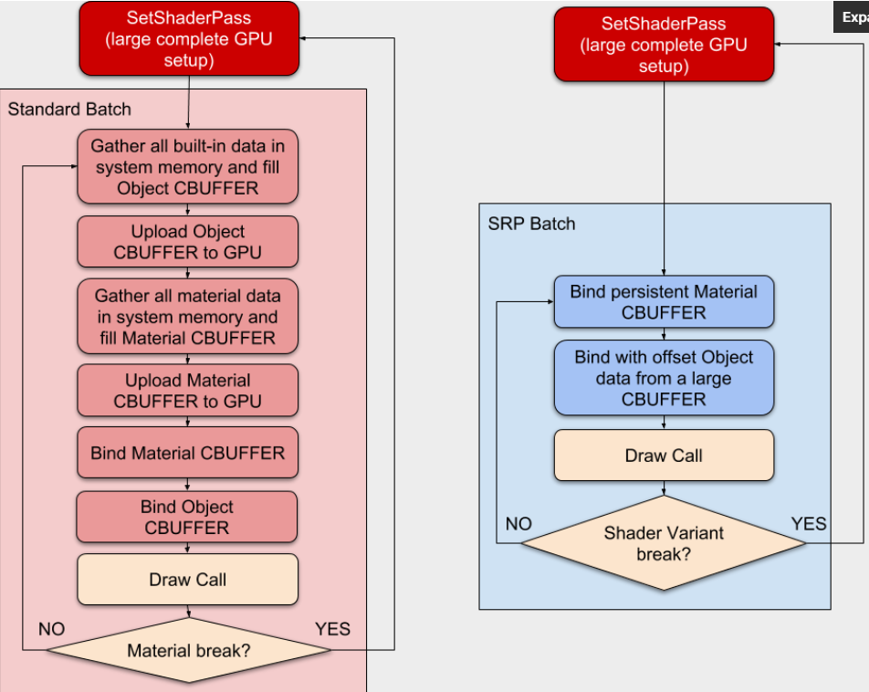

## 游戏图形批量渲染及优化：Unity静态合批技术

**批量渲染总共四篇：**  
1. 静态合批
2. 动态合批
3. 实例化渲染
4. 优化骨骼蒙皮动画，以及两种常用的批量渲染方式：烘焙顶点动画与烘焙骨骼矩阵动画

那么先开始介绍【静态合批】。  
（1）**批量渲染/合批**  
在日常开发中，说到优化、提高帧率就需要提到它。  
批量渲染可以理解为：  
- 通过减少CPU向GPU发送渲染命令（DrawCall）的次数
- 减少GPU切换渲染状态的次数

（2）**静态合批**  
其实就是将静态合批分为**预处理阶段的合并**，和**运行阶段的批处理**。

- 合并阶段  

（x）SRP合批
特点：发送所有几何到GPU，并渲染每个Mesh，会消耗更多内存和CPU周期，但只要是使用相同的shader变体，它就能将不同的Mesh合批。SRP合批在变化的状态(s)之间每个Drawcall都是昂贵的，但SRP合批保持数据留在GPU上，以防在Drawcalls之间高消耗的转换。  
由于缓冲的原因，它们需要不同的shaders，因此最终你可能会使用两个相同的shader，有一个是Instance缓冲，有一个是SRP兼容缓冲。

（x）Instance合批
Instance合批发送给GPU一个mesh，且通过一组矩阵和MaterialPropertyBlocks（改变每网格Instance的参数）来渲染多次。由于仅用到一个Mesh，所以Instance合批节省内存。一组相同的Mesh以Instance方式绘画，只用一个“batch”，但每个唯一的Mesh只有一个Batch的限制。

[拓展：](https://blog.unity.com/technology/srp-batcher-speed-up-your-rendering)

Unity的编辑器可以容许我们任意时间点修改场景的材质属性。同时，Unity特点是非常量缓冲区，支持图形API如DX9。以下是**Standard Unity rendering workflow**。一旦添加新材质给Drawcall，将会有许多工作，场景中材质越多，CPU被要求创建更多的GPU数据。

以下是**SRP Batcher rendering workflow**

可以看到CPU只需处理内置的引擎属性、标签对象矩阵变换。

Compatible objects will use SRP Batcher code path, and others still use the standard SRP code path.

How to check SRP Batcher efficiency?

在这里“batch”这个词的理解很重要，传统上人们意图减少DrawCall的数量来优化CPU渲染消耗。这其中真实的原因是在提交draw之前引擎必须建立大量东西，且真实的CPU消耗来源于建立大量东西，而非DrawCall本身（它只是一点传给GPU命令行缓冲区的字节量而已）。SRP batcher不能减少DrawCalls的数量，它只是减少GPU在大量DrawCalls之间的建立消耗。Standard和SRP的工作流如下：
