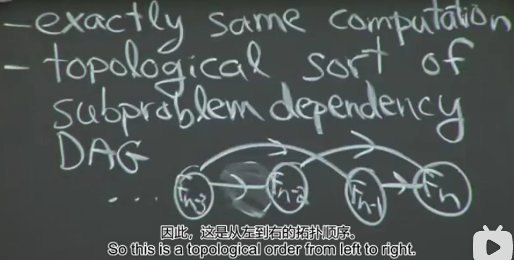

## 动态规划
动态规划（Dynamic Programming），下面用简称dp表示，在了解dp之前，我们先从计算机是怎么工作的说起...  
计算机的本质是一个状态机，亦即图灵机，图灵机的基本特性就是**1) 写/擦的记录能力**，**2) 注意力改变的分支/状态切换能力**，从这两个基本特性就可以延伸出去，图灵说过，只要硬件存储上是无限的，那图灵机理论上能够模拟出人类。  
那么作为状态机，应该具有存储能力，目前一般情况下状态都会存储在状态寄存器上（状态指的是进度、变量等等信息）。  
内存上存储的所有数据本身也构成了当前的状态，CPU只能利用当前的状态计算出下一个状态（记住，唯一不变的就是不能改变下一个状态只能从当前状态计算出来这一条铁律）。  
当你企图使用计算机解决一个问题时，其实就是在思考如何将这个问题表述成状态（用哪些变量存储哪些数据）以及如何在状态中转移（怎样根据一些变量计算出另一些变量）。所以所谓的空间复杂度就是为了支持你的计算所必须存储的状态最多有多少，所谓的时间复杂度就是从初始状态到达最终状态中间需要多少步！

dp：自底向上、指数级的阶段产生

### 评论

1. 每个阶段只有一个状态->**递推**；  
每个阶段的最优状态都是由上一个阶段的最优状态得到的->**贪心**；  
每个阶段的最优状态是由之前所有阶段的状态的组合得到的->**搜索**；  
每个阶段的最优状态可以从之前某个阶段的某个或某些状态直接得到而不管之前这个状态是如何得到的->**动态规划**。

2. 所以一个问题是该用递推、贪心、搜索还是动态规划，完全是由这个问题本身阶段间状态的转移方式决定的。。。 orz，这个不是看原问题的空间，而是你转换后问题的空间，也就是状态表示的空间。往往状态表示是最难的

### 动态规划（Fibonacci）（递归+记忆+猜测）
- 记忆能力（记住）
  - 重用解决方案（core idea）
- 运行时间=必须要解决的子问题数量*它们的处理时间

动态规划（自底向上+记忆）

### 最短路径
