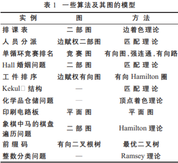
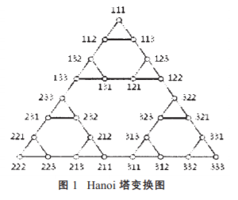

## 机器与图论的关系

从理论上说，任何二元关系都可表示为一个图或有向图。通过图的理论，许多问题一般都可得到很好解决。  
**可化为图论的算法实例：**  

**变换图**  
在图论研究中，人们定义了许多的变换图，从最简单的“狼、羊、白菜”过河问题到较为复杂的Z-变换图。

这些变换图的定义使得一些繁杂的问题变得直观而清晰。一般来说，当我们考察的对象是一些“状态”的集合，且其中一些状态可通过某种变换而互相得到时，都可把它定义成一个变换图来进行研究（其中，“状态”对应于变换图的顶点，而一次变换则是一条边或有向边）。如在计算机鼓轮设计中，一个读数位置就可看作是一个“状态”，而旋转计算机鼓轮的一格就是一个变换，由此定义了一个有向图。这样一来，鼓轮的设计便转化为确定该有向图的有向Hamilton圈的问题。

这类问题都可以定义成一个变换图。然而关键而困难的是要确定这个图的结构，否则，所定义的图便失去了实际价值。在多数实例中，确定变换图的结构往往是较困难的，需要**一定的图论知识和技能的积累**。一个典型的例子是被著名数学家Simon称为“认知科学”中无价的研究标本的Hanoi塔问题：n个盘子在三根针上共有3^n种状态，而搬动一次盘则是一次变换。该问题的变换图T(n)的结构可通过递归的方式得以刻划：T(1)是一个三角形，而T(n)由3个T(n-1)按一定的方式连接起来。变换图得到后，可以很容易地给出任意两种状态间地一个搬盘方案（找出连接相应两点的最短路）。
