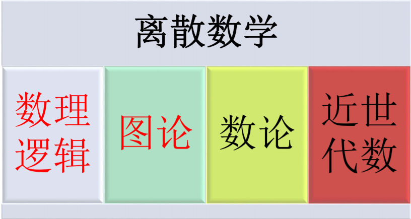
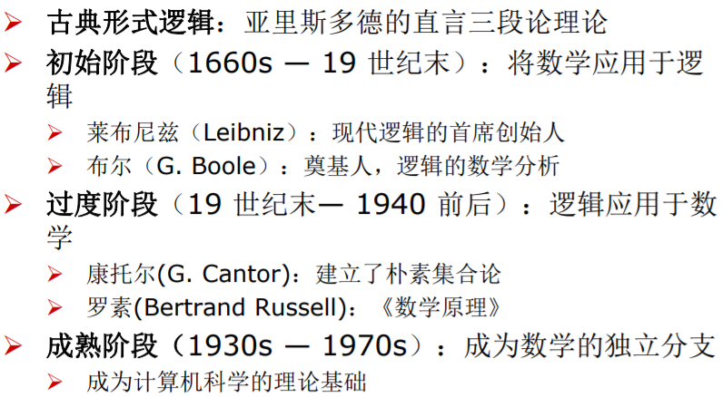

## 离散数学初见
从某种意义上说，数学可分为连续数学（如数学分析(**Numerical Analysis**)、微分方程(**Differential equation**等以研究**连续量**为对象)和离散数学（如代数、图论等以研究**离散量**为对象）。

**离散数学（Discrete Mathematics）**

- 离散数学是现代数学的一个重要分支，是计算机科学中基础理论的核心课程
- 研究**有限个**或**可数**的离散量关系的一门科学
- 研究离散结构的数学分科
- 离散数学充分描述了计算机科学离散性的特征
- 离散数学是随着计算机科学的发展而逐步建立起来的一门新兴的工具性学科，形成于七十年代

**离散数学能解决什么问题**（LISP/声明式语言也能解决）

- 在计算机系统中，有多少种方式可以选择一个合法口令？
- 赢彩票的概率是多少？
- 两台计算机之间在网络上是否有通路？
- 在某一个交通系统下，两个城市之间的最短路径是什么？
- 怎样把整数序列按递增序排列？
- 完成上述排序需要多少步骤？
- 如何证明一个排序方法能正确地排序？
- 有多少合法的因特网网址？

**为什么要学习离散数学**

- **离散数学是计算机科学的数学基础**，其基本概念、理论、方法大量地应用在数字电路、编译原理、数据结构、操作系统、数据库系统、算法设计、人工智能、计算机网络等专业课程中，是这些课程的基础课程。
- **教会学生如何进行思维**：离散数学学习十分有益于概括抽象能力、逻辑思维能力、归纳构造能力的提高，能够培养提高学生的数学思维能力和对实际问题的求解能力。
- 学习方法
  - 强调：逻辑性、抽象性
  - 注重：概念、方法与应用

**离散数学的内容**

- 数学推理：阅读、理解和构造数学证明，包
括数理逻辑和证明方法等
- 组合分析：解决计数问题
- 离散结构：表示离散对象及其之间的关系的
抽象数学结构，包括集合、关系、图、树等
- 算法思维：算法描述、正确性证明、计算时间分析
- 应用和建模：介绍在各领域的应用

### 1.1 命题逻辑（Logic）
**逻辑学**：是一门研究思维形式、规律和推理的科学。分为辩证逻辑和形式逻辑两种。思维的形式结构包括了概念﹑判断和推理之间的结构和联系，其中概念是思维的基本单位（**机器可通过资源模拟出概念、判断、推理三大元素**），通过概念(**公理**)对事物是否具有某种属性进行肯定或否定的回答，就是判断。由一个或几个判断推出另一判断的思维形式就是推理(**定理的由来**)。

**计算机是数理逻辑和电子学相结合的产物！！！**

**计算机是数理逻辑和电子学相结合的产物！！！**

**计算机是数理逻辑和电子学相结合的产物！！！**

### 罗素悖论

前两条是概念/定理，第三条即需要我们去推理，可第三条是推不出来的。（《GEB》**思维和文字是否符合规则**）

### 逻辑学的简单历史

### 命题（Proposition）
定义：命题是一个或真或假的陈述语句，但不能既真又假。

### 双蕴含（bi-imiplication）
定义：令p和q为命题，当p和q具有相同真值时它为真，否则为假。一个双蕴含有时也称为双条件语句（biconditional statement）。（该逻辑符号不能描述逻辑关系吗？）

### 谓词（predicate）
在研究某些推理时，有必要对命题作进一步分析，分析出其中的个体词，谓词和量词，研究它们的**形式结构的逻辑关系**、正确的推理形式和规则，这些正是谓词逻辑的基本内容（**LISP语言也有谓词语法对象**）

命题是具有确定真值的**陈述句**，从语法上分析，一个陈述句由主语和谓语两部分组成。

**命题函数（propositional function）**：谓词和变量的组合，该陈述句含变量，语句既不为真，也不为假。

### 量词
定义：量化 从命题函数产生命题。

### 绑定变量
当量词作用于变量x或给这一变量赋值时，我们说此变量的这一次出现为绑定（bound）的；  
没有被量词绑定或设置为与某一特定值相等的变量出现
为自由（free）的；
  - 出现在命题函数中的所有变量必须通过绑定，才能把此命题函数转变成命题

后部分内容有些类似（《编码》书籍的布尔代数与逻辑电路的转换）

### 推理规则
**假言推理（modus ponens）**：又称分离规则（law of detachment），以重言式为基础的推理规则。假言推理是说，若蕴含式及其前提为真，则这个蕴含式的结论为真。

### 消解
消解（resolution）：基于以下永真式的推理规则，析取q∨r称为消解式（resolvent）。

  - 在计算机程序中经常使用的推理规则；
  - 当r = F时，消解规则成为了析取三段论规则。

### 证明定理的方法
直接证明（direct proof）
- 间接证明（proof by contraposition）
- 空证明（vacuous proof）
- 平凡证明（trivial proof）
- 归谬证明（proof by contradiction）
- 分情形证明
- 等价性证明（proof of equivalence）

链接：[数理逻辑与图论](http://home.ustc.edu.cn/~wy666/graph_theor2018-chapter1.pdf)

### 组合数学（Combinatorics）
一个领域可以通过问题的类型来描述，组合数学涉及以下类型问题：
- 枚举/计数指定结构的数量，有时候涉及安排或配置，联合有限系统。
- 存在满足给定的标准的结构
- 通过许多方式构造一些结构
- 优化，在所有可能方案中找到“最好”的结构或方案，让它成为最大、最小，或满足其他优化标准

| 离散数学 | fafa | daxming |
| -------- | ---- | ------- |
| 12,      | afa  | faf     |