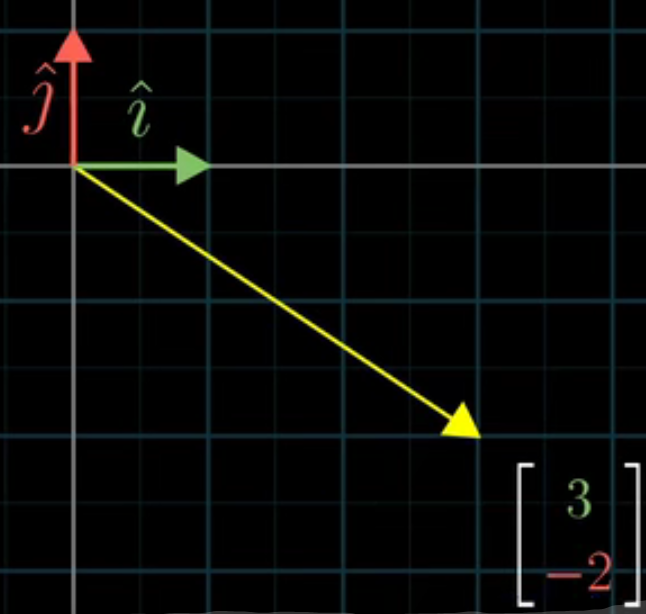

## 线性代数的本质

### 向量究竟是什么
目前对向量的看法有三个领域，即物理、数学和计算机科学。

用数字来描述向量可以很好地联结物理学家和计算机图形程序员，我们从数字（线性代数）和图形两种结构之间找到了同构。

这样，计算机能处理这些有意义的数字并且操纵空间。

举个栗子，当我制作这些动画时，我首先考虑空间中究竟发生了什么，然后在计算机上用数字代表这些变化，从而计算出在屏幕上的哪些地方放置像素。

### 线性组合、张成的空间与基
对向量坐标的一种新看法，当你看到一对描述向量的数时，比如（3，-2），我想你把每个坐标看成是一个标量，就是说它们如何拉伸或压缩一个向量
