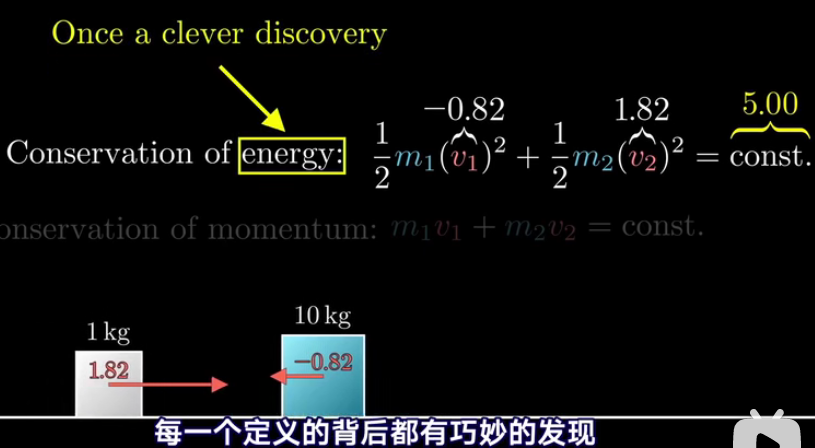
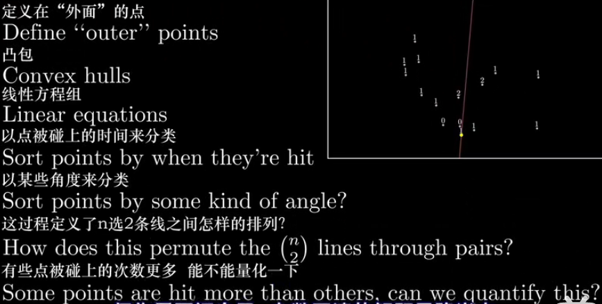

## 大风车问题
```
once you see it, you cannot unsee it.
```
数学问题和谜题对于真正的数学（生活问题）很重要，正如寓言、故事、轶事对新的一代理解人生一样重要。


两个经验总结takeaways
普遍意义：

数学意义：

找到一个在混乱中仍保持不变的东西，这是一个在数学，尤其在物理中，无处不在的主题，
  
你很难去理解别人不懂某些事情的感受，数学出题人指出虽然出题人多种多样，但有一点是不变的，没有一个人能说出自己出的题目的难度，知道哪些数学问题有多难，总是比数学本身更难。

在数不清的解题思路中，为什么某些人要具体使用那种思路呢？



数学意义能教会你该如何应对将来可能面对的实际问题，风车问题就像是一个童话，这个数学伊索寓言，寓意在于要去寻找不变量。