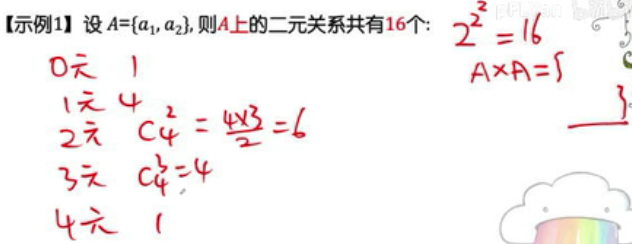

## 关系
关系(笛卡儿积)和函数都是集合

二元关系计算：

### 等价关系
集合S上有许多对元素（a，b），元素之间是否有关系取决于R(Relation)，aRb为true，就说明a和b有关系，false则没有，而若a和b之间在true的基础上还有等价的关系，则应该满足：
1. (自反性)对于所有的a∈S，aRa
2. (对称性)aRb当且仅当bRa
3. (传递性)若aRb且bRc则aRc