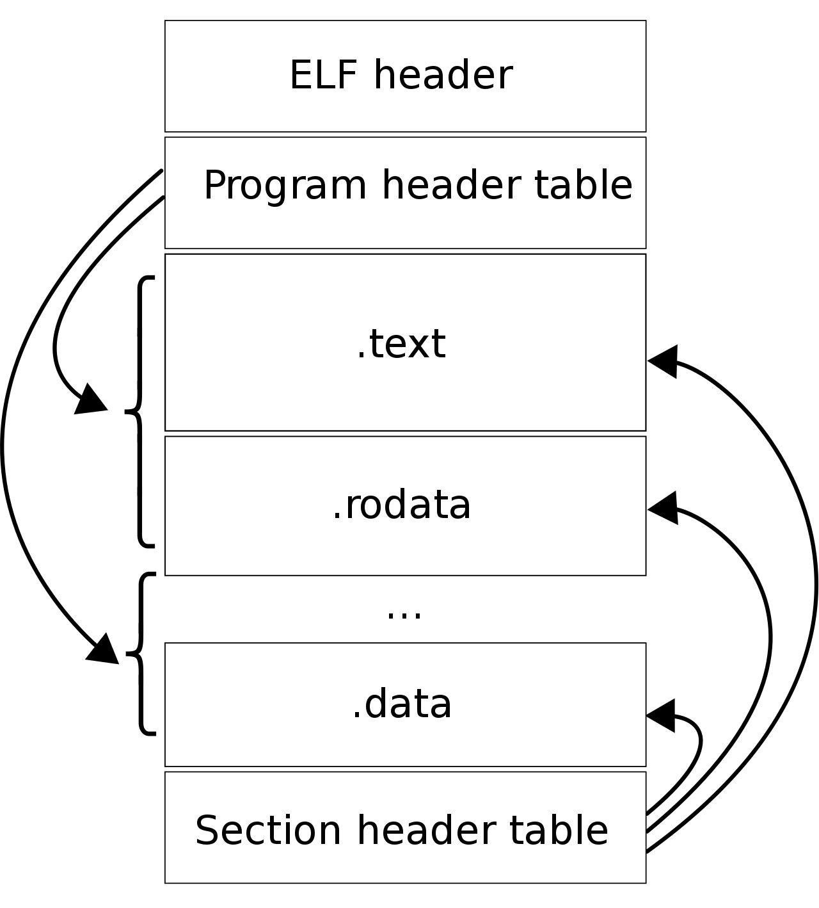

## Mono为何能跨平台
针对该问题，我们需要清楚[跨平台的本质](https://blog.csdn.net/linxinfa/article/details/89464137)是什么？

回答：不同的操作系统或编译器与机器硬件是强相关的。

那么到底有哪些导致操作系统之间不同呢？

回答：linux和windows内核是极具不同的。内核作为一个黑盒，我们只能使用它提供的接口，只有它自己知道如何与硬件进行交互。Linux内核**设计的理念**有几个点：MutiTask（多任务）、SMP（对称多处理）、ELF（可执行文件链接格式）、Monolithic Kernel（宏内核）。

### 什么是MutiTask
多任务的目的是在看似同一时刻下有多个任务在执行，也就是并发/并行。

### 什么是SMP
对称多处理的目的是让每个CPU地位平等，资源使用权限也是相同的，多个CPU共享一个内存。

### 什么是ELF
文件结构格式（设计：有两个重要的表）

### 什么是宏内核
宏内核的设计目的在于一些需要内核权限的长期稳定执行的模块，比如进程调度、内存管理、文件系统、设备驱动等模块，都在内核态。但是设备驱动模块就需要以动态加载形式进入内核态。**与宏内核相反的是微内核**，微内核架构的内核只保留最基本的能力，比如进程调度、虚拟机内存、中断等，把一些应用放到了用户空间，比如驱动程序、文件系统等。

介绍完操作系统的相关设计，我们可以了解到系统之间的差异在于设计上，但硬件是相同的，所以跨平台跨的是操作系统，比如，Mono实现了.NET框架中大部分的基础类库，所以移植.NET应用程序的关键是基础类库的移植，比如WinForm在Linux下的解决方案是GTK。

现在我们有了提供跨平台的解决方案，接下来需要有个地方可以提供这个解决方案，微软开发者设计出了CLR（Common Language Runtime），这个运行时在不同的平台会有不同的上述方案。

CLR这个“中间平台”怎么把一份C#源码依赖的库怎么转换成对应平台的库呢？

回答：这个涉及内部实现，先挖个坑。

Linux和windows系统设计的汇编语言的语法和格式不一样，所以如何将同一份C#源码转换成相应平台的汇编格式呢？

回答：微软开发者提出了新的“汇编”语言（IL）和新的编译器（将C#翻译成IL），再由CLR（JIT模块）翻译成不同平台的汇编代码。

了解了微软C#的来龙去脉，现在回头看Mono，Mono官方自己实现了新的C#编译器mcs.exe，Mono本身实现.NET框架中大部分基础类库，其中关键的是类库的移植，且Mono提供了一个Mono运行时，这样.NET程序就可以脱离.NET框架运行。