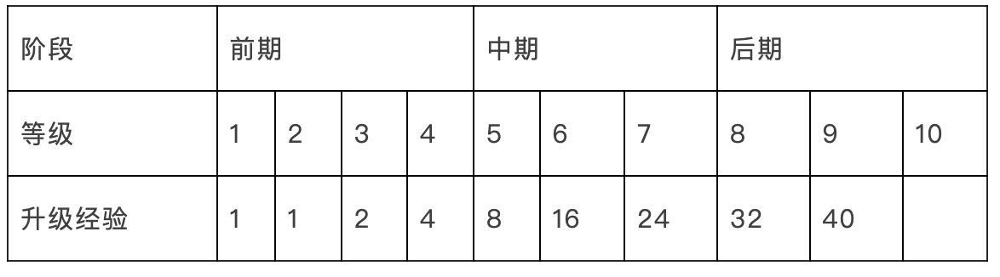
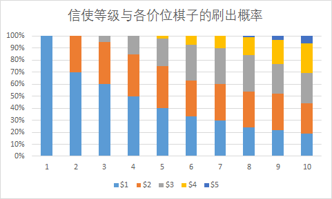

## 自走棋开发日记（一）

### 收集策略棋牌类型游戏信息

### 反编译APK包
1. APK包解压后的目录

| 目录 | 介绍 |
| ----- | ---- |
| assets    | 原始资源文件夹，对应着Android工程的assets文件夹，一般用于存放原始的图片、txt、css等资源文件  |
|lib | 存放应用需要的引用第三方SDK的so库。比如一些底层实现的图片处理、音视频处理等。这是根据不同CPU 型号而划分的，如 ARM，ARM-v7a，x86等 |
|META-INF | 保存apk签名信息，保证apk的完整性和安全性 |
|res |资源文件夹，其中的资源文件包括了布局(layout)，常量值(values)，颜色值(colors)，尺寸值(dimens)，字符串(strings)，自定义样式(styles)等 |
| AndroidManifest.xml | 全局配置文件，里面包含了版本信息、activity、broadcasts等基本配置。不过这里的是二进制的xml文件，无法直接查看，需要反编译后才能查看。 |
| classes.dex| 安卓代码核心部分，dex是在Dalvik虚拟机上可以执行的文件。如果有classes.dex和classes2.dex两个文件，说明工程的方法数较多，进行了拆分|
| resources.arsc| 记录资源文件和资源id的映射关系|

2. 通过AssetStudio.exe提取AB包

3. Assembly-CSharp.pdb文件的利用

### Unity编译Android的原理解析和APK打包分析

由于UnityPlayer类做了混淆，关于渲染的核心功能也封装在native代码中，关于Scene转换到到UnityPlayer作为FrameLayout，只能做一个简单的推测：通过调用Android的GL渲染引擎，在native层进行渲染，并同步到FrameLayout在UnityPlayerActivity上进行显示。

五、Unity打包Android apk的结构探究
通过对比Unity打包的apk，与普通的Android apk的文件差别，找到Unity文件存放的目录，对应存放在Android Studio目录，最后通过AS完成对Unity相关文件的打包。

### 技能编辑器
#### 序列化问题
1. 多态序列化
2. PropertyAttribute扩展Inspector
3. 嵌套ScriptableObject可以保存路径解耦
4. SerializedObject和ScriptableObject配合使用，可以方便在EditorWindow里面绘制内容

#### 使用Odin Inspector建议
- 使用Odin写的Editor Window是非常方便快捷的，比Unity自带的EditorWindow以非常短的时间开发更好的Window
- MonoBehaviour类需继承SerializedMonoBehaviour，该类尽量不要作为预制体去处理。

### 自定义编辑器窗口
#### asmdef目的
自定义明晰的依赖关系

#### 资源更新问题
1. application.streamingAssetes获取的路径是已经带了file:/或者jar:file:/协议的，application.persistentPath获取到的路径是不带协议的
2. streamingAssetes在android和ios上是只读的，并且不能用File操作
3. File操作的路径是不需要带文件协议的

#### [资源加载与优化（一）](https://blog.csdn.net/smile_Ho/article/details/107288409)

#### 动态库之间的引用问题

### [玩法构建数据模型](https://gameinstitute.qq.com/community/detail/108942)
填表的难点：

- 成体系的填数据
- 控制各个数值在游戏中的最终效果

游戏中需要引入大量很难量化的东西，比如嘲讽、冲锋、无敌、隐身，还有暴击的概率。

#### 属性设计的基本流程
1. 概要的设计职业玩法
2. 设计各个职业的每个技能
3. 设计玩家操作
4. 设计战斗公式
5. 设计职业属性
6. 填写技能参数和技能升级表
7. 对部分职业计算其真正的实战属性
8. 构思每个职业之间战斗的策略、效果、把平衡性变成具体的设计指标

### 几个设计理念在此机制中的应用
- 简洁的规则：2元刷牌+看牌+选牌
- 明确的反馈：选到牌时，可直接用于合成升级、触发羁绊特效;未选到牌，则进入利息少的恶性循环，资金难以再次积累起来。
- 平衡的数值：让玩家无法轻易的找到全局最优的搜卡策略(用最小的风险换取最大的收益)

- 高度自由的选择权：
  |自由度|发|
  |----|----|
  |选择连败还是连胜?(对血量资源的利用和控制)|类似麻将的机制，棋子总共就那么几对，选了这个，则能推出只剩下哪几个，再推出对手是否有组出比我更优质的牌组。|
  选择热门套路还是冷门套路?(对有限棋子的争夺)
  与对手套路相似，是否转型?(对沉默成本的控制)
  刷到强势卡棋子，是否转型?(对稀有棋子资源的利用)
  是否要把钱留着升级信使or吃利息?(对局势的长远规划)|
  
#### 分布式系统
系统中存在一个以全局的方式管理计算机资源的分布式操作系统。通常，对用户来说，分布式系统只有一个模型或范型。在操作系统之上有一层软件中间件（middleware）负责实现这个模型。一个著名的分布式系统的例子是万维网（World Wide Web），在万维网中，所有的一切看起来就好像是一个文档（Web页面）一样。

#### 内聚和耦合
- 内聚：从**功能角度**来度量模块内的联系，一个好的内聚模块应当恰好做一件事，它描述的是**模块内**的功能联系。（模块的自主性）
- 耦合：软件结构中各**模块之间**相互连接的一种度量

### [自走棋阵容挖掘及平衡性分析](https://gameinstitute.qq.com/knowledge/100081)
世界流程：  
1. 8个玩家购买公共牌库的牌（会影响彼此的选择）

### 遗传算法GA
1. 进化不一定是往更高、更快、更强方向，有时是往更“适”的方向
2. 大样本（组件搭配起来的系统更大）才能具有更兼容性的能力。
----
&nbsp;&nbsp;将节点比作身体部位（手、脚），连线比作肌肉（Maya里的关节），如果通过以上的概念造出个人体，且走起来像个人样，需要将脚部的重量加大。

**涉及的专业术语**：COG、BOS（支撑基础 (BOS) 是指物体或人下方的区域，包括该物体或人与支撑表面的每个接触点）

Reference:
1.  庖丁解牛：对刀塔自走棋的最详细剖析。作者、平台及日期：何北航，游资网，2019-02-18。地址：https://www.gameres.com/837393.html
2.  知乎用户“eggache”在问题“如何评价刀塔自走棋2月26日更新兽人法亡灵猎萨尔均被削弱？”中的回答。作者、平台及日期：eggache，知乎，2019-02-27。地址：https://www.zhihu.com/question/313698471/answer/609411946
3.  dota自走棋 棋子全资料 2019.01.26版本。作者、平台及日期：浅无意，dota自走棋吧，2019-01-27。地址：http://tieba.baidu.com/p/6019424110
4.  全英雄图鉴+职业&种族速查表。作者、平台及日期：UID14406396，NGA DotA自走棋，2019-02-26。地址：http://nga.178.com/read.php?tid=16502979
5.  从概率的角度解析搜卡时机与搜卡策略。作者、平台及日期：UID41663697，NGA DotA自走棋，2019-03-12。地址：http://nga.178.com/read.php?tid=16633151
6.  刀塔自走棋简单分析。作者、平台及日期：我是来造谣的，游资网-游戏策划版，2019-02-20。地址：https://bbs.gameres.com/thread_837689_1_1.html
7.  没玩过也能看懂的刀塔自走棋攻略。作者、平台及日期：电竞GO，知乎问答，2019-03-31。地址：https://www.zhihu.com/question/308229866/answer/568977238
8.  什么时候存钱和花钱？作者、平台及日期：电竞GO，知乎问答，2019-02-18。地址：https://www.zhihu.com/question/310409346/answer/583037183
9.  阵容站位有什么技巧？作者、平台及日期：电竞GO，知乎问答，2019-02-18。地址：https://www.zhihu.com/question/310110208/answer/580746804
10.  21只谜团置疑自走棋卡池规则。作者、平台及日期：零的祝福，旅法师营地，2019-03-25。地址：https://www.iyingdi.com/web/bbspost/detail/1868851
11.  浅谈扣血量。作者、平台及日期：浮生不偷闲，旅法师营地，2019-03-24。地址：https://www.iyingdi.com/web/bbspost/detail/1868041
12.  牌上的花色 – MUD中的玩家。作者、平台及日期：原作Richard A. Bartle，译者韦易笑，游资网，2016-09-28。地址：https://www.gameres.com/684100.html
13.  数说自走棋。作者、平台及日期：旅法师营地王益，旅法师营地，2019-03-26。地址：https://www.iyingdi.com/web/article/search/73005
14.  刀塔自走棋全棋子各等级属性成长数据一览。作者、平台及日期：NGA/哈酷那马獭獭，游迅网，2019-01-29。地址：http://www.yxdown.com/gonglue/442733.html