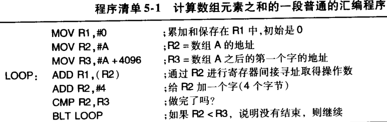
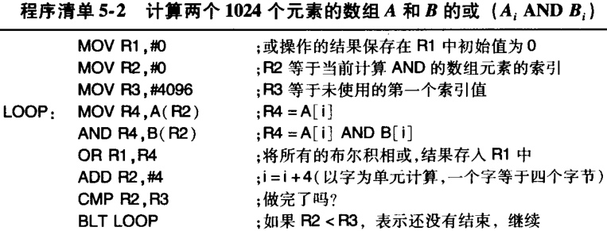

## 指令系统层
计算机底层设计理念：把各种不同的高级语言程序转换成一种通用的中间形式——指令系统层程序———再设计能直接执行指令系统程序的硬件。

指令系统层相当于提供给**词汇表的字符集**。

一个好的指令系统层有两个主要因素：  
1. 指令集要能够**高效率**的实现（不需要太多逻辑门来实现处理器和更多的内存来执行程序）
2. 指令系统层应能够**为词汇表提供明确的字符集**。

指令系统层决定什么是存储模式、寄存器组织，什么是合法的数据类型和指令。

指令系统层的另一个重要特性是它具有两个模式———**内核模式和用户模式**。（能够使用的指令有差别）

既然说到提供字符集，那么肯定需要先有存储字符的能力！

### 5.1.2 存储模式
存储单元定为8位一单元，称为一个字节。
ASCII字符，用ASCII编码（只需要8位）的方式。UNICODE字符，用UNICODE编码（需要16位）的方式。
字符集在4个/8个字节为一组的情况下，方便以字对内存管理（对齐的思想)。

### 5.1.3 寄存器
在指令系统层可见的寄存器在微体系结构层一定可见，因为它们正是由微体系结构层实现的。

指令系统层**能够利用**的寄存器粗略地分为两类：专用与通用，专用包括**程序计数器**（转移注意力的能力）、栈指针和其他一些专门用途的寄存器。而通用包括**保存**重要的局部变量和中间计算结果，它们的主要用途是提供快速的手段来访问那些使用频繁的数据（避免内存访问）。

### 5.2 数据类型
指令系统层使用多种不同的数据类型。

### 5.2.1 数值数据类型
数值型的和非数值型的。整数有多种长度，典型的长度有8位、16位、32位和64位。

### 5.2.2 非数值数据类型
字符类型，最常用的字符编码是ASCII（8位）、UNICODE（16位）。指令系统层有专门的字符串指令，可以执行复制、查找、编辑等操作。

布尔值类型，位图（bitmap），指32位的字表示32个布尔值。位图用于表示磁盘上的空闲块（磁盘有n块，位图就有n位）。

指针类型，机器地址，指令系统层有专门的指令ILOAD，工作方式就是通过指针加上固定的偏移量来访问变量。

### 5.3 指令格式

### 5.3.1 指令格式设计准则
如果内存访问速度很快，基于栈的设计（IJVM）就是一个很好的设计，但如果内存访问速度很慢，那么有大量寄存器的设计（Ultra SPARC III）性能可能更好。

指令长度达到最小可能会使译码和重叠执行变得困难。因此，在考虑最小指令长度时，必须同时考虑译码和指令执行所需要的时间。

准则关于地址字段中位的数量。一台使用8位字符，具有2^32个字符大小主存的计算机。

### 5.4 寻址方式（操作数来源方式）
操作数是指令的作用对象，指令是指令系统层的字符集元素，不可由用户修改，只可使用，操作数是存储在内存/寄存器的字符，可以由用户修改。

#### 5.4.5 寄存器间接寻址

前三个指令的第一个操作数使用了寄存器寻址，而第二个操作数使用立即寻址。第二条指令把**A的地址**放入R2，而不是把A本身的内容放入R2。第三条指令把A数组之后的第一个元素的地址放入R3.在循环体中没有使用任何内存地址.在第四条指令中使用了寄存器寻址和寄存器间接寻址,第五条指令使用了寄存器寻址和立即寻址,第六条指令使用了两次寄存器寻址.(因为并不需要向内存获取或发送数据)

### 5.4.6 变址寻址
用户自定义字符（比如非数值型数据）存在于内存的情况下，操作数应该是A(R2);

### 5.4.9 转移指令的寻址方式
转移指令和过程调用指令也需要寻址方式来指定操作数（即地址）。