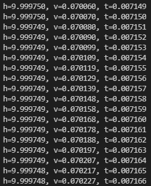

## 
今天主要面对的是检查大作业，物理模拟的实现需要具备计算机的基本知识、物理公式及相关数学概念，这会是一个很漫长的旅程，计算机由于它的数字性质，决定了它是离散的，在这离散的性质上面，实现连续性质的集合关系运算，只要逻辑是正确的，那么推广到无穷也是正确的。

在计算机模拟中，dt取得越小模拟结果越精确，但模拟的速度也就越慢。

观察上图，发现v每打印4个加一次9，其他加10。这跟我的CPU频率有关，不同的机器频率不一样，导致位移h的误差，但如果误差小到可以接受，则模拟成功。

**PS：**
1. 1g的cpu一个时钟周期用时1ns（纳秒）
2. CPU的主频不代表CPU的速度，但提高主频对于提高CPU运算速度却是至关重要的。举个例子来说，假设某个CPU在一个时钟周期内执行一条运算指令，那么当CPU运行在100MHz主频时，将比它运行在50MHz主频时速度快一倍。因为100MHz的时钟周期比50MHz的时钟周期占用时间减少了一半，也就是工作在100MHz主频的CPU执行一条运算指令所需时间仅为10ns比工作在50MHz主频时的20ns缩短了一半，自然运算速度也就快了一倍。只不过电脑的整体运行速度不仅取决于CPU运算速度，**还与其它各分系统的运行情况有关**（组合配合），只有在提高主频的同时，各分系统运行速度和各分系统之间的数据传输速度都能得到提高后，电脑整体的运行速度才能真正得到提高。