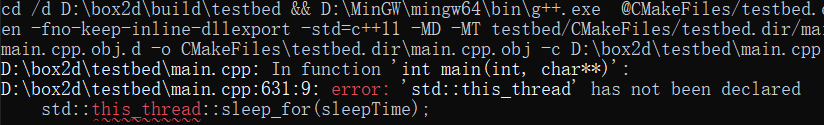
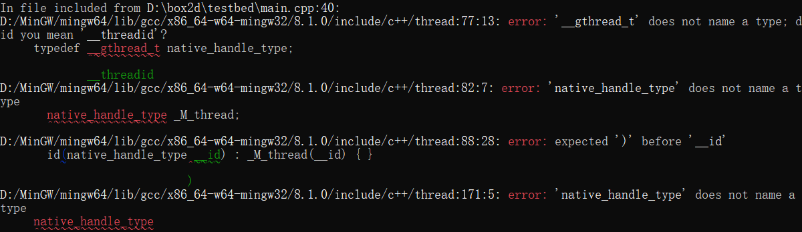

## 使用MinGW的感想
最近使用MinGW编译链box2d项目工程，遇到了挺多麻烦，要不缺这要不缺那的，最重要的是它竟然没有C的静态链接标准库libc.a，这表明它没有printf、scanf这些输入输出函数的实现。当然也可以想办法链接外部的libc.a，但又是一番折腾。

先说说遇到的一系列问题，首先，一开始因为某些原因修改了doctest.h的源码，把**代码块条件分支**给注释掉了，导致命名空间里的同名方法出现多处定义；  
然后，就遇到了C++的标准库thread问题，该库内部使用了#if defined(_GLIBCXX_HAS_GTHREADS) && defined(_GLIBCXX_USE_C99_STDINT_TR1)这个条件分支，使得我main.cpp文件里使用的sleep_for方法被编译器认定为**has not been declared**.

关于MinGW和Cygwin的区别在[StackOverflow](https://stackoverflow.com/questions/771756/what-is-the-difference-between-cygwin-and-mingw)有相关讨论。

## C++线程类踩坑

拓展：  
[MinGW64介绍](https://blog.csdn.net/Mculover666/article/details/89844460)