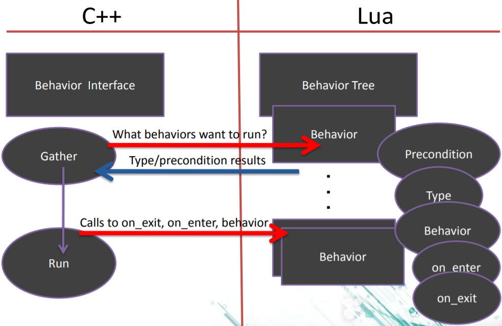

## 行为树（数据驱动写法）
#### Tip：
- 使用黑板，解耦行为树
- 将有目的的行为构建为一系列短期目标导向的行动
- 小心那些保持运行的“类状态”行为
- 利用树搜索的力量

#### 集成上脚本
- 所有行为树都很灵活
  - 选择器的选择
  - 可重用的目标
- 快速遍历
- 将行为和算法/逻辑分离

#### 创建行为树的脚本
- 行为树通用结构
  - 前提条件
  - 行为
- 可选择的组件
  - Type(priority, sequential, random)
  - on_enter, on_exit
  - 你自己决定行为是什么

#### 定义行为
- behavior add, remove, update, exit, enter...

#### akara行为树节点
- CompositeNode组合节点
- DecoratorNode装饰节点
- ConditionNode条件节点
- ActionNode行为节点 
 
各种节点的详细描述：  
- SelectorNode选择节点  
描述：从头到尾，按顺序选择第一个执行条件为真的子节点，遇到True停止。
处理流程：当执行本类型Node时，它将从begin到end迭代执行自己的ChildNode：如遇到一个ChildNode执行后返回True，那停止迭代，本Node向自己的ParentNode也返回True；否则所有ChildNode都返回False，那本Node向自己的ParentNode返回False。

- SequenceNode序列节点  
描述：从头到尾，按顺序执行每一个子节点，遇到False停止。
处理流程：当执行本类型Node时，它将从begin到end迭代执行自己的ChildNode：如遇到一个ChildNode执行后返回False，那停止迭代，本Node向自己的ParentNode也返回False；否则所有ChildNode都返回True，那本Node向自己的ParentNode返回True。

- ParallelNode并行节点
描述：从头到尾，平行执行它的所有子节点。
ParallelSelectorNode:有一个子节点True返回True，否则返回 False。
ParallelSequenceNode:有一个子节点False返回False，否则返回True。 
ParallelFallOnAllNode:所有子节点False才返回False，否则返回True。 
ParallelSucceedOnAllNode:所有子节点True才返回True，否则返回False。 
ParallelHybirdNode:指定数量的子节点返回True或False后，才决定结果。 

- DecoratorNode装饰节点
描述：装饰节点一般用来作为额外的附加条件。例如，时间间隔控制，次数控制，频率控制，结果取反，错误处理等。

- ConditionNode条件节点  
描述：顾名思义，就是对应条件的节点。

- ActionNode行为节点 
描述：顾名思义，就是用于完成某种动作的节点

问题1：什么是节点？

回答：由于节点会被浏览到，所以节点具有状态，节点具有条件，节点有要执行的任务

问题2：设计出ECS的哲学
回答：面对具体问题具体分析，那么具体问题是什么呢？——如何提供一套框架实现独特的**规则**、**目标**、**动态世界元素**？

回答：让我设计一套框架应对这三个数据对象，首先需了解动态世界元素是什么？

回答：动态世界元素指的是游戏对象**模型**。这些模型具有行为、属性。

问题3：数据驱动与观察者模式的结合？

