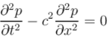

## 左手练习
### 声学的数学模型
在数学上，我们使用标量波动方程来描述声波沿一维空间和时间的传播
  
这是一个偏微分方程（PDE），其中 t 表示时间，x 表示空间坐标，c 表示声速，p 表示压力（因变量）。

Reference：
http://cn.comsol.com/multiphysics/acoustics
https://blog.csdn.net/define_us/category_2926715.html