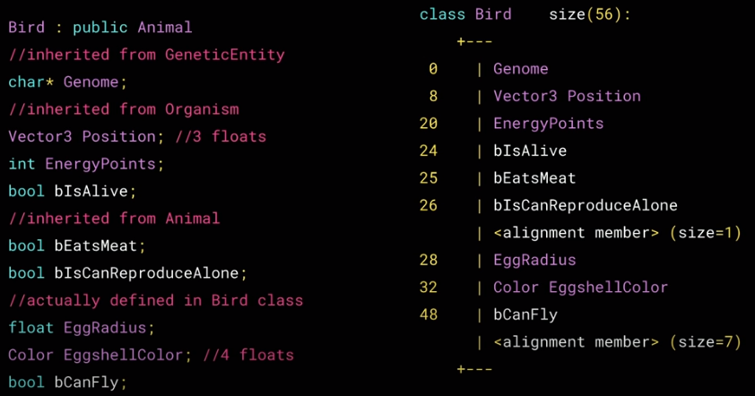
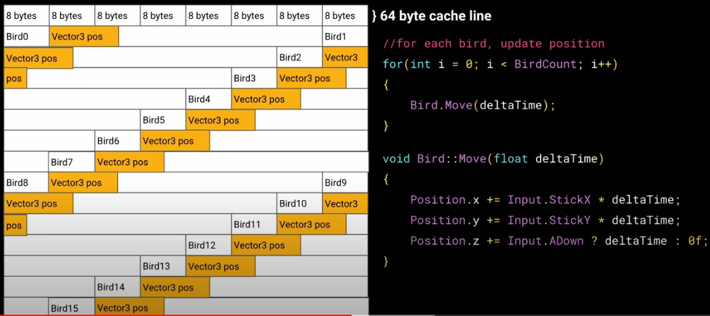
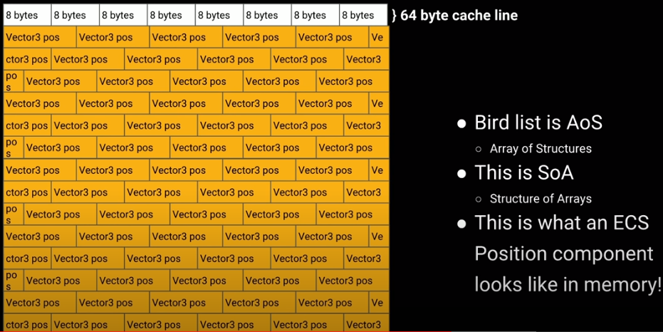
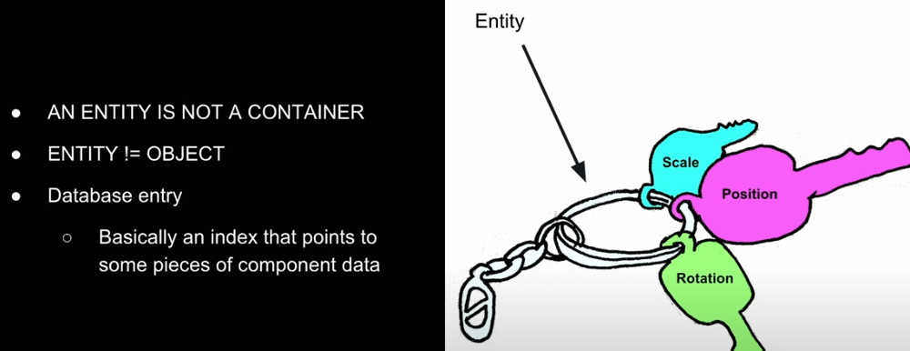
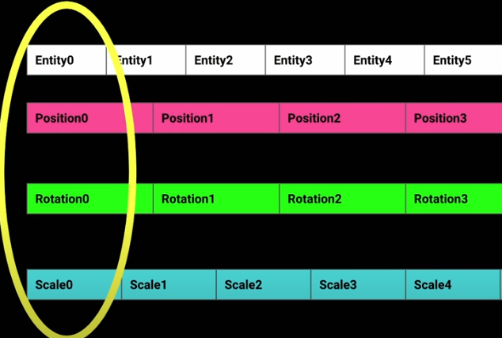
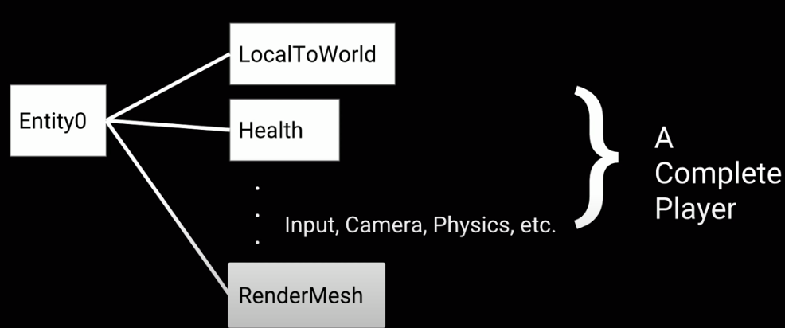

## 架构与方法模式
### 无状态和有状态的模式
- 无状态编程：与数学符号-函数相关。表示没有过去的内存存储。所有行为就像在一开始时就已经执行过一样
- 有状态编程：具有过去的内存存储。过去的内容可以影响现在的行为。
- 主要区别在于**有没有记忆**
```
// The state is derived by what is passed into the function

function int addOne(int number)
{
    return number + 1;
}

// The state is maintained by the function

private int _number = 0; //initially zero

function int addOne()
{
   _number++;
   return _number;
}
```

### 响应式编程模式
- 异步数据流

  - 任何东西都可以是流模型：变量、用户输入、属性、缓存、数据结构等等，比如推特反馈是流，点击事件也是，你可以监听流，然后进行响应。
- 组合、创建、过滤任何流s的函数工具箱


问题1：明天能否解决写法模式该应用于何种模型/系统上？

回答：类似于现实世界的人（模型），工作时专注（模式1），玩的时候放松（模式2）

模块问题，我现在在编写Node的节点模型（有自主性），之后还需要有哪些模型呢？容器？。

行为树的节点类似函数调用


### GDC2019 理解面向数据模式之于ECS
#### 缓存和内存
- 空间局部性

  - 所有数据都来自同一个地方
- 暂时局部性

  - 所有数据都来自同一时间点





#### 面向数据模式
- 缓存利用率高，数据局部性好

ECS组件的模型即是数据模型。

#### 如何设计你的数据模型
- 考虑处理步骤

  - Inputs -> Processing -> Outputs
  - Read-only vs RW
- 考虑自主性

  - 什么数据模型可以独立地执行
- 考虑缓存

  - 保持Component数据模型尽量小
  - 思考数据局部性
-----
**DONT**

- 以对象的思维思考一组数据

  - 实体Entities不是容器Containers
- 全局遍历

  - 可以利用数据库去搜索数据
- 将数据和行为组合

  - Data == Components
  - Behavior == Systems



不同的数据模型会有单独的数组，每个Entity都是一个索引号





### 2019GDC 以DOTS模式编写游戏
#### 什么时候该使用DOTS
- 解决特定问题
- 绕过技术难点

ECS只是Data-Oriented的一种应用，需要高性能的场景在实现中要写DO的代码，比如物理系统、动画系统。

对于逻辑关系复杂的，使用OOP更好维护。Data Driven旨在化硬编码为灵活的数据。自主性高。


### [纯函数与非纯函数](https://en.wikipedia.org/wiki/Pure_function)
- 纯函数：指不依赖外部状态，且没有副作用的函数，应该是声明为静态的。对new出来的对象进行修改绝对不会影响其他对象。
```
void f() {
  // atomic原子类型封装了一个值得类型，保证了数据不会竞争，
  static std::atomic<unsigned int> x = 0;
  ++x;
}
```

- 非纯函数：random(), printf()都是非纯函数，每次调用潜在地产生不同的值。


### 脚本语言
- 方便快速开发，因为脚本语言易上手，合作门槛低

#### 脚本语言的选择
- 数据定义语言

  - 自定义文本格式
  - Excel comma-separated values(.csv)
  - XML, ...
- 运行时语言

  - Python, Lua, Pawn(Small C), OCaml, F#,...
- 流行引擎提供的脚本语言

  - Quake C, UnrealScript, C#(XNA), ...

### State-Based Scripting in Uncharted 2
- 状态脚本类似于以属性为中心的架构模型

  - 附有有限状态机支持
  - 与“属性”无特别挂钩
  - 粗粒度（每物体一脚本）
- 更像脚本化的扩展

  - 或是一个“引导者”，协调其他实体的行为

### 状态脚本内部构造
- 一个状态脚本包括：

  - 特性
  - 状态
- 状态通过运行时脚本代码定义物体的行为

  - 对事件的响应
  - 基于时间的自然行为（轮转update事件）
  - 状态之间的过渡行为（开始/结束 事件）


Reference：
https://www.slideshare.net/naughty_dog/statebased-scripting-in-uncharted-2-among-thieves