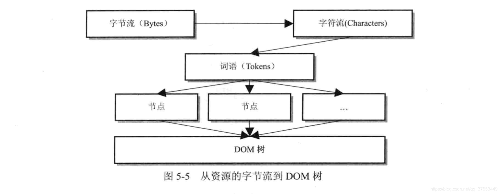
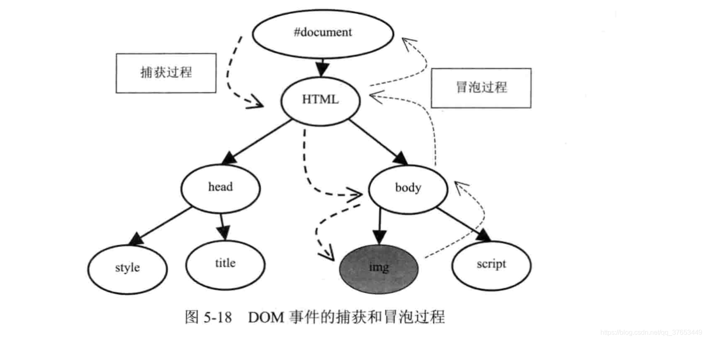

## Web学习日记（一）
时间：1990年

网络工作所必需的工具：一个万维网编辑器，一个Web服务器（有自身地址信息、域名）。

### Web的特点
1. 可视化的界面
2. 分布式结构，资源存在其他服务器站点上
3. 与平台无关性，如Chrome
4. 动态性，信息的动态更新
5. 交互性，编辑器以及超链接


### Web实现的理论支撑
1. 网卡
2. URL的设计，协议类型：//服务器地址（端口号）/路径/文件名

### HTML脚本语言
可以定义网页的内容，如标题、副标题、段落、无序列表、定义列表、表格、表单

### 级联样式表（Cascading Style Sheet）,JavaScript
联想:安卓的布局可视化

布局、字体、颜色、背景

JavaScript是一种基于对象和事件驱动的脚本语言。

#### Java脚本的组成
- 核心（ECMAScript）
- 文档对象模型
- 浏览器对象模型

### HTML DOM文档对象模型
DOM接口与JavaScript结合起来实现Web网页的行为和结构的分离。
HTML文档里所有元素的访问入口，文档对象模型接口来获得。

### HTML文档结构
文档由头部head和主体body两部分组成。

### [HTML解释器](https://blog.csdn.net/qq_37653449/article/details/90762063)
功能：将网络或者本地磁盘获取的HTML网页和资源从字节流解释称DOM树结构。


- 词法分析：解释器首先检查网页内容使用的编码格式，然后使用相应的解码器来将字节流转换成特定格式的字符串（字符流），HTMLTokenizer类可以进行词法分析。它其实就是一个状态机，输入：字节流，输出：字符串。
- XSSAuditor类验证词语：验证字符串流，过滤掉被阻止的内容。
- 词语到节点：HTMLDocumentParser类调用HTMLTreeBuilder类的constructTree函数实现节点构建。
- 节点到DOM树：从节点到构建DOM树，包括为树中的节点创建属性节点等由HTMLConstructSite类实现，该类包含一个DOM树的根节点——**HTMLDocument对象**，其他都是该节点的后代。
```
HTML 文档的 Tag 标签是有开始和结束标记的，所以构建这一过程可以
使用栈结构来帮忙。HTMLConstructionSite 类中包含一个
“HTMLElementStack” 变量，它是一个保存元素节点的栈，其中的元素
节点是当前有开始标记但是还没有结束标记的元素节点。想象一下 HTML 
文档的特点，例如一个片段 <body><div></img></div></body>
当解释到 img 元素的开始标记时，栈中的元素就是 body 、div 和 
img ,当遇到 img 的结束标记时，img 退栈， img 是 div 元素的子
女；当遇到 div 的结束标记时，div 退栈，表明 div 和它的子女都已
处理完，以此类推。
```

<!-- ```C
 scanf()
``` -->
<!-- Markdown
:fa -->

- JavaScript的执行:  

- DOM事件机制：
