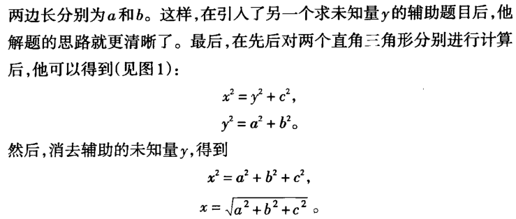

## 波多利亚学解题
### 怎样解题
1. 未知量是什么？已知数据是什么？条件是什么？条件是否足以确定未知量？或者它不够**充分**？或者**多余**？或者**矛盾**？

画一张图，引入适当的符号。  
将条件的不同部分分开。

第一步，量够且不冗余的情况下，第二步，观察内在联系

方法：  
1. 联系相关的知识结构
2. 利用已知解法
3. 外部引入辅助元素
4. 分解再重组
----
2. 有内在联系，又要符合规则，再就是最优


----
5. 常识性（特征，联想）  
&nbsp;**观察未知量！我希望得到未知量，并尽量想出一个你所熟悉的具有相同或相似未知量的题目**。你饿了吗？你希望得到食品，并想起得到食品的一些熟悉的方法来。<font color=red>（思维活动后部分）</font>

<!-- 有点类似小孩子根据相似点寻找方法，这还不足够，还需要限定范围，得到最优解。 -->

按正确方法做的人通常<font color=red>并不注意用清楚的语言来表达他的做法</font>，他也可能没有能力那么表达；而我们的表则试图这样来表达。

6. 模仿实践  
教师心中可能有两个目的：第一，帮助学生解手上的题目；第二，提高学生的能力，使他将来能自己解题。<font color=red>表中的问题和建议有两个共同的特征：常识性和普遍性</font>。

对表中的一些问题吸收得很好，以致最终能够在恰当的时刻**向自己**提出恰当问题，并且进行相应的思维活动。学习技能的时候，我必须观察和模仿别人在解题时的做法，最后你通过解题学会了解题。我需要对题目感兴趣，且有足够时间去模仿和实践（十年磨一剑，我要磨什么），教师在课堂解题时，应当对自己的思路稍加渲染，且要向自己提出帮助学生时使用的同样一些问题（教师也要向自己提问题，营造氛围）。

**PS**：  
- 解题技能指的是1.如何提问题；2.如何找与源问题相似的简单问题；
- 我的设计作品/属于我的问题在哪？
#### <font color=purple>对自己想做什么这个问题进行辅助性问题的提问</font>
1. 什么事情是我最热爱的？物理现象，重要的是能利用计算机工具（指针）来模拟物理现象（在原理的基础上结合工具）。
2. 自己模式、工作模式贯穿自己的哲学开心充实
3. 工作的按时完成能够为自己的另一个模式保留充足的时间。
4. 我自己喜欢作为粘合剂的角色吗？工作模式时运用自己的能力去粘合组员们，自己模式时设计作品需要的解题工具、工程技术工具的运用（组员帮忙）。
5. **我的哲学：专注、充实**

### <font color=blue>主要部分，主要问题</font>
7. 四个阶段。在找到解法之前，我们会不断地改变观察问题的方式，就像在学<font color=red>工程技术（不过是工具）</font>一样（**待修正**）。

为了将问题和建议这些工具归类和汇集在一起，我们将我们的工作分为四个阶段。

- 必须理解该题目；必须清楚地看到所要求的是什么
- 必须了解各个项目是如何相关的，未知量和数据之间有什么关系

8. 理解题目。自己复述问题的陈述，指出未知量、已知数据和条件。

9. 例子。已知长方体的长、宽和高，求它的对角线长度。由于a、b、c是已知的，我们就知道了长方体，如果长方体确定，其对角线也就被确定了。

10. 拟定方案。<font color=purple>解答一个题目的主要成就在于构思一个解题方案的思路，是一个**思维活动**的过程。</font>
- 我们当然知道，如果我们只有关于该主题的很少知识，要产生解答题目的思路是曲折且不断试错的；而如果没有任何知识，那就完全不可能产生。（AI遗传算法）。记忆与材料是基础必需的。虽然记忆和材料是基础，但我们不能仅仅只有基础，还需要能够运用得上，如何运用得上呢？我们可以提问题：你知道一道与它有关的题目吗？提提议：观察未知量！并尽量想出一道你所熟悉的具有相同或相似未知量的题目。

11. 例子。长方体的对角线只是一条线段，是一条直线的一部分。相似的题目比如说求一个直角三角形的一条边。在原题目中引入三角形这个具有决定性的辅助元素。

为了不让学生忘记自己的解题方案，可以用“直觉的”或“形式的”证明来确认我们的推理中每一步的正确性：

12. 回顾。解题的途径，<font color=red>找解题方案的期间不能越来越偏离主题，要贴紧“未知量”和“条件”。</font>没有任何一个题目是彻底完成了的<font color=blue>（设计作品也是）</font>，总还会有些事情可以做<font color=purple>（什么会让我一直感到开心）</font>；在经过充分的研究和洞察后，我们将任何解题方法加以改进；而且无论如何，我们总可以深化我们对答案的理解<font color=red>（有助于同构吧）</font>。

**总结**：专注于好习惯，技能会有所提高

17. 好问题与坏问题。坏问题会导致学生不会经历一遍思维活动，没有启发性。也很难明白教师是如何获得提出这样一个问题的思路（不知道为什么这么问）。

20. 一道速率题。对一个未知量进行证明，确保它是存在的，再去进行解题。题目：圆锥形容器，以水速2英寸立方/分，圆锥底面半径4英寸，高3英寸为数据，求出当水深y=1时，水面上升的速度。（假定了解微积分和变化率的概念）

### 第三部分 探索法小词典
#### <center>类比</center>
```
刘未鹏说过联系、类比、试错是天生就会的认知模式（显然的）。

著名物理学家爱因斯坦说：“发展独立思考和独立判断的一般能力，
应当始终放在首位，而不应当把专业知识放在首位。如果一个人掌
握了他的学科的基础理论，并且学会了独立思考和工作，他必定会
找到自己的道路。”

Video games are not meant to be fun, neither deep, 
nor to promote challenge, exploration, creation or
socialization. All those goals can be reached by the
medium, but none are intrinsically more important 
than the others.

Gameplay, writing, realisation and story are all tools
serving goals, and can only be judged on the way they 
contribute to the goal of the  game they're in. The first 
thing creators should do when imagining their games is to 
set the list of objectives they want to reach, and then to 
make sure that all the parts of their games, and especially 
what the player does, contributes to reach those goals.

The incapacity of building games around a creative vision,
the focus on the tools rather than objectives and the 
underground assumption gameplay can only be judged on its 
value to create fun is what leads so many AAA titles to 
feel so dissonant and forgettable. Hopefully it will change.
```
类比：一种相似性。**相似的物体**在某些方面彼此一致，**类似的物体**则在它们相应部分的特定关系上相一致。