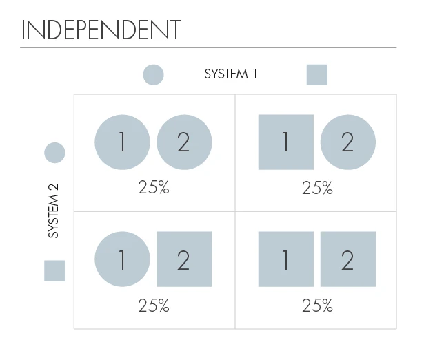

## 科学大类
- 自然科学
- 社会科学
- 人文科学

### 社会科学
定义：

### 人文科学
定义：文学、历史、哲学、艺术，是以人为本的学科，可以说是今天许多其他学科、尤其社会科学诸学科的母体，它们大多是近代以来从其分化出来的。  
1. 研究对象：研究的是人的观念、精神、情感和价值

### 电影导演
- 科恩兄弟
- 吉尔莫·德尔·托罗
- 大卫林奇
- 塔可夫斯基
- 张艺谋
- 周星驰
- EVA作者
- 费德里科·费里尼
- 英格玛·伯格曼

### 科学与艺术的交融
参考：达芬奇  
**世界物理年**：2005年  
**Reference**：https://finance.sina.com.cn/tech/2021-05-23/doc-ikmyaawc7043861.shtml  
[量子计算突破图灵机模型](https://www.infoq.cn/article/fu1i661uwbh1ldv16opv)

#### 量子纠缠
