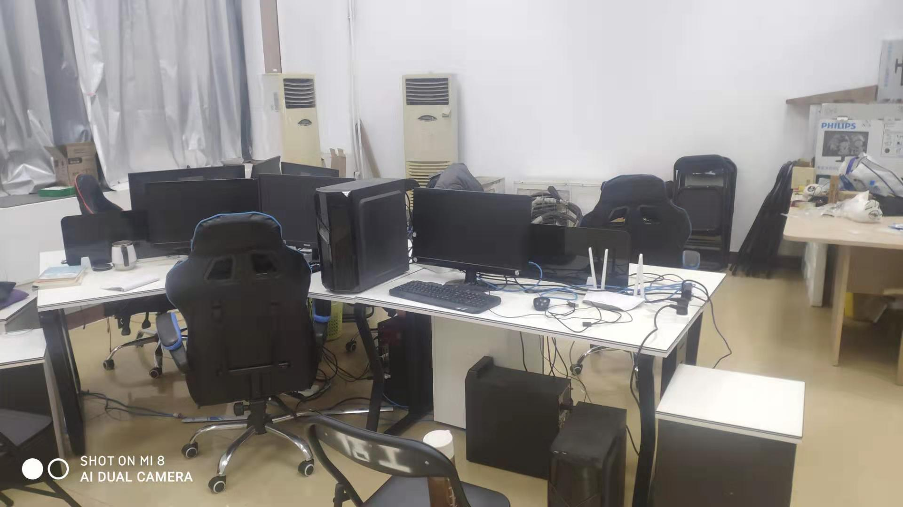
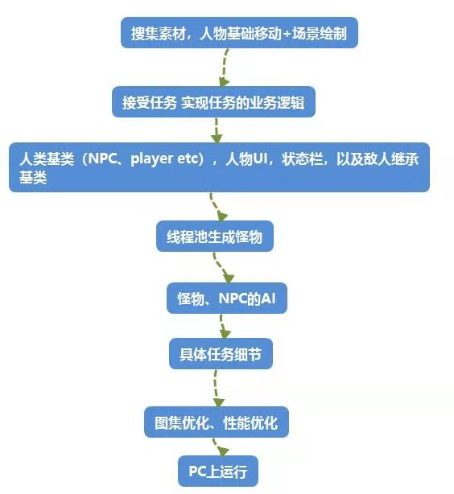
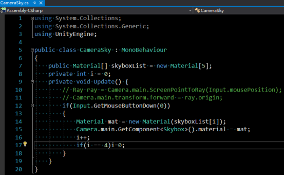
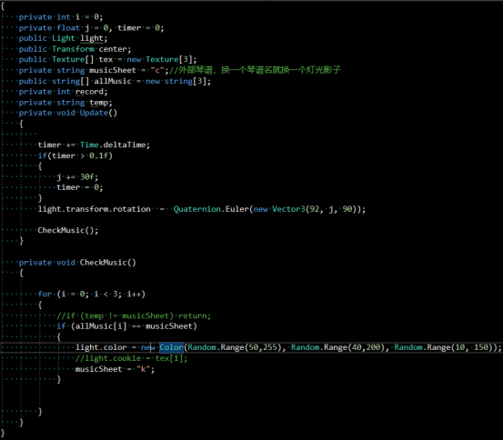
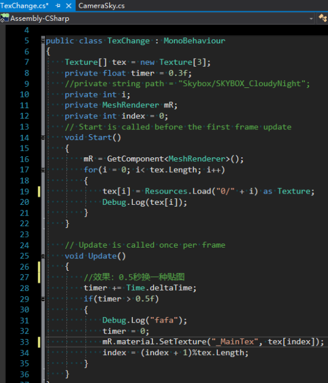

## 数字媒体工作室（2020.10-2021.03）
### 工作室内部照

---
## 项目经历

- 工具使用：Resilio Sync、Unity3D、Visual Studio

### VR钢琴
- 负责场景美术的搭建、粒子特效
- 负责大部分逻辑实现，如琴键行为、发声、检测虚拟手等
- 与程序沟通合作，解决项目相关问题
- 与美术合作，实现钢琴模型开发的流程从美术到程序的落地
- 负责功能的相关测试

### 3DRPG闯关游戏：
- 负责部分Gameplay、UI以及AI的逻辑实现
- 与美术合作，实现UI从美术到程序的落地
- 与程序沟通合作，解决项目相关问题
- 负责收尾的功能测试

### 关于项目其他信息
- RPG游戏相关需求

- VR钢琴相关需求
  - 天空盒切换  
  
  - 灯光切换，灯光运动  
  
  - 0.5秒换一次贴图  

